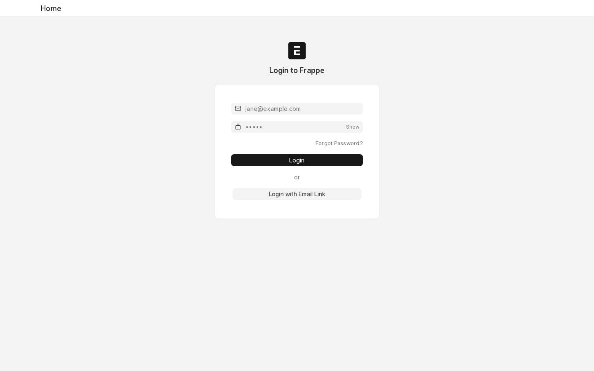
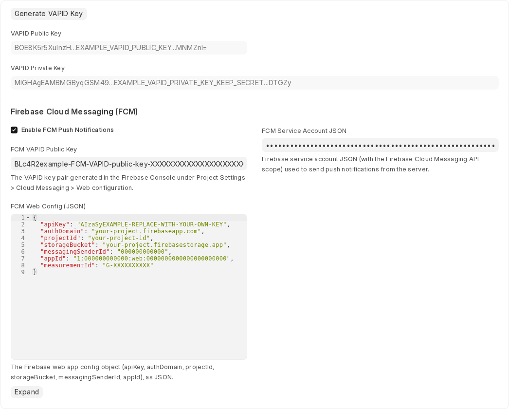
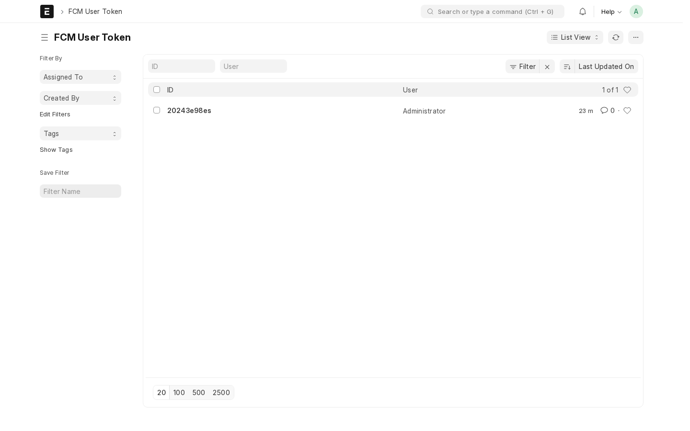

# 🌐 PWA Frappe

A **Progressive Web App (PWA)** implementation for the **Frappe Framework**, enabling your applications to be installed and run as native-like apps on both desktop and mobile devices. 🚀

---

## ✨ Features

- ⚡ **Progressive Web App Support** — Turn your Frappe site into an installable PWA
- 📱 **Cross-Platform Installation** — Works on iOS, Android, and Chrome Desktop
- 🔔 **FCM Push Notifications** — Firebase Cloud Messaging for desk `Notification Log` alerts (mentions, assignments, shares, energy points)
- 💾 **Offline-First Architecture** — Smart caching via Service Worker
- 🎨 **Customizable Manifest** — Icons, colors, display modes & screenshots
- 🧩 **Easy Configuration** — Manage everything from simple Frappe DocTypes

---

## 🧰 Installation

Use [bench](https://github.com/frappe/bench) to install the app:

```bash
cd $PATH_TO_YOUR_BENCH
bench get-app https://github.com/omfsakib/pwa_frappe --branch main
bench install-app pwa_frappe
```

---

## ⚙️ Configuration

### 1️⃣ Web App Manifest Setup

Go to **Web App Manifest** in your Frappe Desk and configure:

- 🏷️ **App Name** — Full name of your app
- 🔤 **Short Name** — Short display name
- 🎨 **Theme & Background Colors**
- 🧭 **Display Mode** — `fullscreen`, `standalone`, `minimal-ui`, or `browser`
- 🖼️ **Icons** — Upload in multiple sizes (192x192, 512x512 recommended)
- 📸 **Screenshots & Categories** — For app store appearance

### 2️⃣ Auto PWA Configuration

Click **"Automatically configure PWA"** to:
- ✅ Add manifest link to Website Settings
- ✅ Enable PWA features automatically
- ✅ Optionally enable Desk Mode support

### 3️⃣ Service Worker Setup (Optional)

Visit **Service Worker** doctype to:
- 🔑 Generate VAPID keys for classic Web Push
- ⚙️ Configure caching and update policies

### 4️⃣ FCM Push Notifications

Every logged-in desk user gets a browser push notification whenever a `Notification Log` entry is created for them (mentions, assignments, shares, energy points, alerts) — no changes needed on the Frappe/ERPNext side, this hooks into the core `Notification Log` doctype. Nothing for end users to click or configure: it enables itself silently on their next desk login, once an admin has set it up (below).

#### A. Admin setup (one-time, per site)

1. Log in to your site's Desk as a System Manager (e.g. `Administrator`).

   

2. Create a [Firebase project](https://console.firebase.google.com/) and enable **Cloud Messaging**.
3. Under **Project Settings → Cloud Messaging → Web configuration**, generate a **Web Push certificate (VAPID key pair)** and copy the public key.
4. Under **Project Settings → General**, copy the **Web app config** (`apiKey`, `authDomain`, `projectId`, `storageBucket`, `messagingSenderId`, `appId`).
5. Under **Project Settings → Service accounts**, generate a new private key (downloads a JSON file) — this is used server-side to send messages via the FCM HTTP v1 API.
6. In your Frappe Desk, open the **Service Worker** doctype and fill in the **Firebase Cloud Messaging (FCM)** section:
   - ✅ **Enable FCM Push Notifications**
   - 🔑 **FCM VAPID Public Key** — from step 3
   - ⚙️ **FCM Web Config (JSON)** — from step 4
   - 🔒 **FCM Service Account JSON** — paste the full contents of the file from step 5 (stored encrypted, never shown again in plain text)
   - Click **Save**.

   

   > The values in the screenshot are placeholders — use your own project's keys, not these.

That's it — no further admin action needed. Every desk user (including the admin) will pick this up automatically on their next login.

#### B. What end users see

Nothing to configure. On their next desk load, the browser will silently register for push and — the *first* time only — show the browser's native "Allow notifications?" permission prompt. Once **Allow** is clicked, they're subscribed for good; nothing changes for them if they click nothing or dismiss it (they simply won't get push notifications until they allow it, which they can also do later from the browser's own site-permissions UI).

A successful subscription creates a record in **FCM User Token**, one per user per browser/device:



Tokens FCM reports as unregistered (e.g. browser data cleared, uninstalled) are pruned automatically the next time a push is attempted.

#### C. Testing

Trigger a real test notification for any user at any time:

```bash
bench --site [site-name] execute pwa_frappe.fcm.test_push_notification --args "['Administrator']"
```

This inserts a real `Notification Log` entry for that user, which flows through the exact same code path as a genuine mention/assignment — if they're subscribed, they'll get a real push.

---

## 💡 Usage

### 🖥️ Desktop (Chrome/Edge)
1. Visit your site
2. Click the **Install icon** in the address bar or select **Install [App Name]**

### 📱 Android
1. Open your site in Chrome
2. Tap **Add to Home Screen** when prompted

### 🍎 iOS (Safari)
1. Open your site in Safari
2. Tap **Share → Add to Home Screen → Add**

Visit `/install` for a full installation guide.

---

## 🧱 Technical Details

### 📁 Directory Structure

```
pwa_frappe/
├── pwa_frappe/
│   ├── doctype/
│   │   ├── service_worker/           # Service Worker + FCM config
│   │   ├── fcm_user_token/           # Per-user FCM tokens
│   │   └── web_app_manifest/         # Manifest settings
│   ├── fcm.py                        # FCM subscribe/unsubscribe + Notification Log push
│   ├── public/js/
│   │   ├── pwa_frappe.js             # Desk manifest injection
│   │   └── fcm.js                    # Desk FCM registration & foreground messages
│   └── www/
│       ├── app.html                  # PWA-enabled Desk template
│       ├── manifest.json             # Dynamic manifest endpoint
│       ├── sw.js                     # Service Worker script (+ FCM background messages)
│       ├── pwa.js                    # Client-side PWA logic
│       └── install.html              # Installation instructions
```

### 🧠 Service Worker Caching

Caches:
- Static assets (CSS, JS, images)
- Frappe core resources
- Custom app assets defined in hooks

Old caches are auto-cleared upon activation 🔁

### 📄 DocTypes

1. **Web App Manifest** — Main configuration
2. **Manifest Icon / Screenshot / Category / Related App** — Child tables
3. **Service Worker** — Caching & FCM notifications config
4. **FCM User Token** — Registered browser push tokens per user

---

## 🧑‍💻 Development

### 🔧 Prerequisites

```bash
cd apps/pwa_frappe
pre-commit install
```

### 🧹 Code Quality

- 🐍 **Ruff** — Python linting
- 💅 **Prettier** — Code formatting
- 🧭 **ESLint** — JavaScript linting

### 🧪 Testing

```bash
bench --site [site-name] run-tests --app pwa_frappe
```

---

## 🧩 Customization

### 🔗 Hooks Integration

In your `hooks.py`:

```python
app_include_js = ["/assets/pwa_frappe/js/pwa.js"]
web_include_js = ["/assets/pwa_frappe/js/pwa.js"]
```

### 🧠 Service Worker Extensions

Extend to include custom routes or caching strategies.

---

## 🌍 Browser Support

✅ Chrome (Desktop & Mobile)
✅ Safari (iOS 11.3+)

---

## ⚠️ Limitations

- 🔔 FCM push notifications currently cover the desk `Notification Log` doctype only (no portal/website push yet)
- 🔒 HTTPS required for PWA features
- 🍎 Limited iOS PWA support (and no push notifications on iOS Safari)

---

## 🧰 Troubleshooting

**❌ PWA not installing?**
- Ensure HTTPS is enabled
- Verify `/manifest.json` is reachable
- Check Service Worker registration in DevTools

**🔁 Service Worker not updating?**
- Hard refresh (**Ctrl+Shift+R**)
- Clear site data
- Update cache version

---

## 🤝 Contributing

1. Fork this repo
2. Create a feature branch
3. Run pre-commit checks
4. Submit a PR 🧡

---

## 📜 License

MIT License — see [license.txt](license.txt)

---

## 🙌 Credits

Originally developed by **Md Omar Faruk**
Maintained by the **Frappe Community**

---

## 🧭 Support

- 📚 [Frappe Documentation](https://frappeframework.com)
- 💬 [Frappe Forum](https://discuss.frappe.io)
- 🐛 [Issue Tracker](https://github.com/omfsakib/pwa_frappe/issues)
